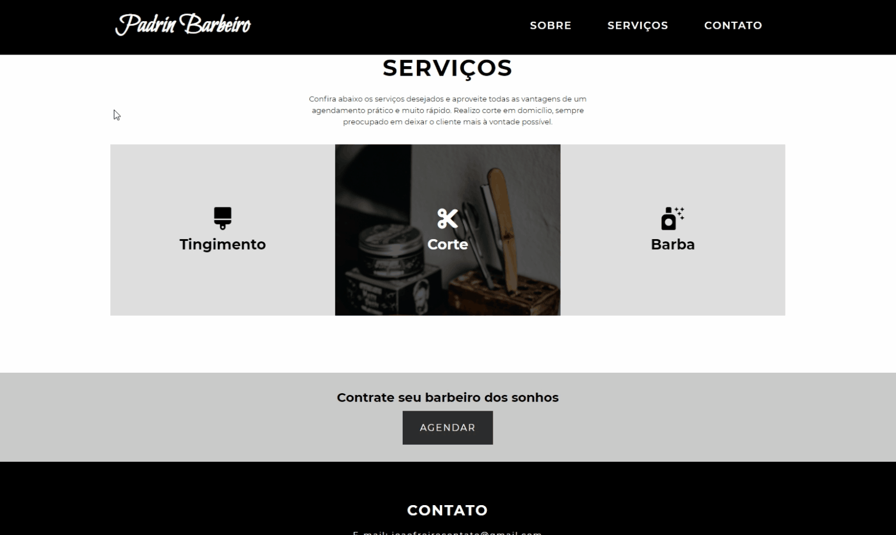

<h1 align="center">
    
</h1>

    <h3> 🪒 Seu Barbeiro da Vida 🪒 </h3>
    
     
    

# Padrin Barbeiro

Uma simples página feita para um amigo barbeiro utilizando HTML, CSS e um pouquinho de JavaScript.

  

  

# 🛠️ Tecnologias

💻 HTML

💻 CSS

💻 JavaScript

## :camera: Veja:

### 🖥️ Desktop

### 📱 Mobile

### ☑️ Código:

## Agradecimentos ao Padrin

Deixo minha recomendação ao profissional João Víctor Alves. Ele me permitiu desenvolver e colocar essa simples página aqui no Github para aplicar meus conhecimentos em HTML, CSS e JavaScript. Se você mora pelas proximidades de Engenho de Dentro, Méier e Tijuca e está precisando dos serviços de um barbeiro, chama o Padrin que ele dá conta do recado.

